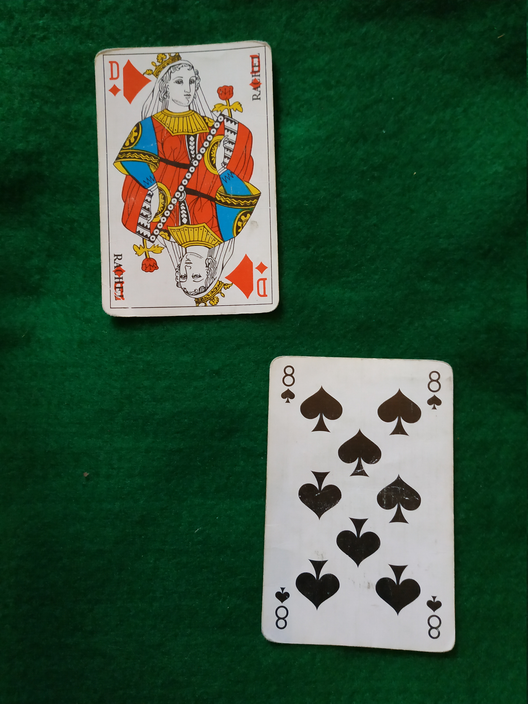
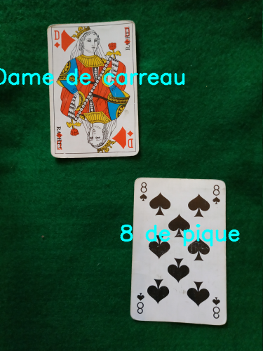

<h1 align="center">Welcome to Cards Classification using Computer Vision and OpenCV 👋</h1>

This personnal project was developped following a request from my 8 y.o sister, who wanted a way to keep track of the cards that had been played, without requiring her to actually remember them

Currently, this project is able to recognize cards from her card set, in a way that is fast enough to consider classification on live video stream using a webcam placed above the board

## Approach

The images are treated with the following pipeline:

* Preprocessing : 
	* Resizing to standard format - ensure that the program is robust to various cameras
	* Converting to gray scale - colors are not necessary
	* Add Gaussian Blurr - remove noise for the next step
	* Canny Detection - convert the image to edges

* Cards Detection :
	* From the image with edges, find the contours
	* Approximate the contour's perimeter and select relevant contours

* Rank and Suit Extraction - for each card found:
	* Crop, rotate and resize the image to build an image of the card
	* Zoom on the top left corner of the image, and split the image in 2
	* For each region, find the biggest contour to get respectively the rank and the suit

* Rank and Suit Classification - for each rank and suit extracted :
	* Using a Nearest Neighbor classifier, with data that were hand-labeled (by my little sister, I'm not going to do everything)
	* Output the label and write it on the image

## Author

👤 **Louis Morin**

